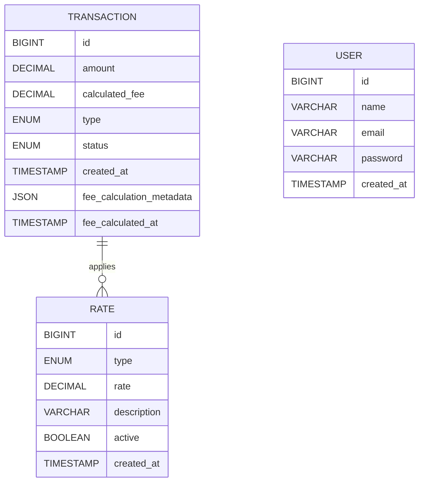

# EasyBank Database Schema

## Overview
The EasyBank database schema is designed to efficiently manage users, accounts, and transactions, ensuring high performance and security. The database follows a relational model with well-defined relationships between entities.

## Database Tables

### **User Table**
Stores information about EasyBank users.

| Column      | Data Type    | Constraints           | Description                    |
|------------|-------------|----------------------|--------------------------------|
| id         | BIGINT      | PRIMARY KEY, AUTO_INCREMENT | Unique identifier for users   |
| name       | VARCHAR(255) | NOT NULL             | Full name of the user         |
| email      | VARCHAR(255) | UNIQUE, NOT NULL     | Email address of the user     |
| password   | VARCHAR(255) | NOT NULL             | Encrypted password            |
| created_at | TIMESTAMP   | DEFAULT CURRENT_TIMESTAMP | Account creation timestamp |

### **Transaction Table**
Records all financial transactions.

| Column        | Data Type    | Constraints                                  | Description                       |
|--------------|-------------|---------------------------------------------|-----------------------------------|
| id           | BIGINT      | PRIMARY KEY, AUTO_INCREMENT                 | Unique transaction ID            |
| amount       | DECIMAL(19,2) | NOT NULL                                  | Transaction amount               |
| calculated_fee | DECIMAL(19,2) | NOT NULL                                | Calculated transaction fee       |
| type         | ENUM('DEPOSIT', 'WITHDRAWAL', 'TRANSFER', 'PAYMENT') | NOT NULL | Type of transaction     |
| status       | ENUM('PENDING', 'PROCESSING', 'PROCESSED') | NOT NULL    | Current transaction status      |
| created_at   | TIMESTAMP   | DEFAULT CURRENT_TIMESTAMP                   | Transaction creation timestamp   |
| fee_calculation_metadata | JSON | NULL                                   | Metadata about fee calculation   |
| fee_calculated_at | TIMESTAMP | NULL                                     | When the fee was calculated     |

### **Rate Table**
Stores transaction rates and fees.

| Column      | Data Type    | Constraints           | Description                     |
|------------|-------------|----------------------|---------------------------------|
| id         | BIGINT      | PRIMARY KEY, AUTO_INCREMENT | Unique rate identifier       |
| type       | ENUM('DEPOSIT', 'WITHDRAWAL', 'TRANSFER', 'PAYMENT') | NOT NULL | Type of transaction     |
| rate       | DECIMAL(19,2) | NOT NULL             | Rate percentage                |
| description | VARCHAR(255) | NOT NULL             | Rate description               |
| active     | BOOLEAN     | NOT NULL             | Whether the rate is active     |
| created_at | TIMESTAMP   | DEFAULT CURRENT_TIMESTAMP | Rate creation timestamp    |

### **Transaction Type ENUM Definition**
The `type` field in both **Transaction** and **Rate** tables defines the type of financial operation. The possible values are:
- **DEPOSIT** – Adding funds to an account
- **WITHDRAWAL** – Removing funds from an account
- **TRANSFER** – Moving funds between accounts
- **PAYMENT** – Paying for services or bills

### **Transaction Status ENUM Definition**
The `status` field in the **Transaction** table tracks the processing state:
- **PENDING** – Initial state, awaiting processing
- **PROCESSING** – Currently being processed
- **PROCESSED** – Processing completed

## Entity Relationship Diagram (ERD)

## Future Enhancements
- Add support for multi-currency transactions.
- Implement account interest calculation for savings accounts.
- Introduce transaction categorization for better expense tracking.

This schema ensures data consistency, security, and scalability while providing a solid foundation for EasyBank's financial operations.
