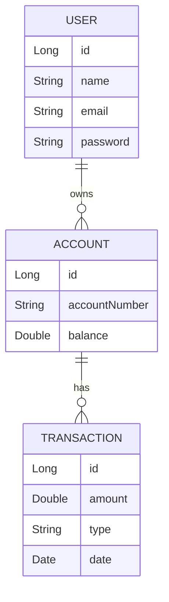

# EasyBank Project Plan

## **1️⃣ Project Overview**
📌 **Name:** EasyBank - Digital Financial Services   
📌 **Description:** A secure microservices-based banking platform for financial operations  
📌 **Objective:** Create an efficient, scalable, and secure system for banking operations  

## **2️⃣ System Architecture**
### **🔄 Microservices**
- **User Service** - User management and authentication
- **Transaction Service** - Handle financial transactions
- **Rate Service** - Manage transaction rates and fees

### **⚙️ Core Features**
#### User Management
✔ Create and manage users  
✔ Secure authentication with JWT  
✔ Email validation  
✔ Password encryption  

#### Rate Management
✔ Define transaction rates  
✔ Active/Inactive rate management  
✔ Rate types for different transactions  

#### Transaction Processing
✔ Create and process transactions  
✔ Transaction fee calculation  
✔ Status tracking (PENDING, COMPLETED)  
✔ Transaction history  

### **🛠 Technical Stack**
#### Backend
✔ **Framework:** Spring Boot 3.x  
✔ **Database:** MySQL 8+  
✔ **Security:** Spring Security + JWT  
✔ **Testing:** JUnit 5 + Mockito  
✔ **Documentation:** SpringDoc OpenAPI  

#### Development Tools
✔ **Build Tool:** Maven  
✔ **Code Quality:** Lombok, MapStruct  
✔ **Monitoring:** Spring Boot Actuator  

## **3️⃣ Implementation Status**
### **✅ Completed**
- Basic project structure setup
- User service implementation
- Rate service implementation
- Transaction service implementation
- Unit tests for all services
- Database schema design
- Security configuration

### **🚧 In Progress**
- Integration tests
- API documentation
- Service integration
- Error handling improvements

### **📋 Pending**
- Deployment configuration
- Monitoring setup
- Performance optimization
- User interface development

## **4️⃣ Next Steps**
1. Complete integration tests
2. Implement comprehensive API documentation
3. Set up CI/CD pipeline
4. Deploy services to production environment

## **5️⃣ Timeline**
- **Phase 1:** Core services implementation ✅
- **Phase 2:** Testing and documentation 🚧
- **Phase 3:** Deployment and monitoring 📋
- **Phase 4:** UI development and integration 📋

---

## **2️⃣ System Requirements**
### **🔐 Non-Functional Requirements**
✔ API must be **secure** following **OAuth2 / JWT** best practices  
✔ System must support **high availability**  
✔ Resilience in external calls (**Retry, Circuit Breaker with Resilience4j**)  
✔ Database **MySQL/PostgreSQL**  
✔ API documentation with **Swagger**  

---

## **3️⃣ System Architecture**
📌 **Pattern:** **Hexagonal Architecture** (or Clean Architecture)  
📌 **Application Type:** **Spring Boot REST API**  
📌 **Database:** **MySQL/PostgreSQL**  
📌 **Authentication:** **Spring Security + JWT**  
📌 **Monitoring:** **Actuator + Prometheus/Grafana**  

🔹 **Technology Stack**
| Technology  | Purpose |
|-------------|----------|
| [**Java 23**](https://docs.oracle.com/en/java/javase/23/) | Main programming language |
| [**Spring Boot**](https://spring.io/projects/spring-boot) | Core framework |
| [**Spring Web**](https://spring.io/projects/spring-web) | REST API |
| [**Spring Data JPA**](https://spring.io/projects/spring-data-jpa) | Database management |
| [**Spring Security**](https://spring.io/projects/spring-security) | Security layer |
| [**JWT**](https://github.com/jwtk/jjwt) | Authentication |
| [**Lombok**](https://projectlombok.org/) | Reduces boilerplate code |
| [**OpenAPI / Swagger**](https://springdoc.org/) | API documentation |
| [**Docker**](https://www.docker.com/) | Containerization |

---

## **4️⃣ Data Modeling**
**Main Entities**:
- **User**
- **Account**
- **Transaction**

**Relationships:**  
📌 Each **User** can have multiple **Bank Accounts**  
📌 Each **Account** can have multiple **Transactions**  

### **Example Data Model**


---

## **5️⃣ Request Flow**
🔹 **Authentication Flow**:  
1️⃣ User logs in with email/password  
2️⃣ API returns a **JWT Token**  
3️⃣ User uses this token to access secured routes  

🔹 **Bank Transfer Flow**:  
1️⃣ User selects source and destination accounts  
2️⃣ API verifies the balance  
3️⃣ API executes the transfer and records the transaction  

---

## **6️⃣ API Documentation**
📌 **Use Swagger to expose endpoints**  
📌 **Provide example JSON payloads**  

Example **POST** request to create a user:
```json
{
  "name": "John Doe",
  "email": "john.doe@email.com",
  "password": "123456"
}
```

---

## **7️⃣ Tools and Deployment**
✔ **Version Control:** GitHub/GitLab  
✔ **CI/CD:** GitHub Actions or Jenkins  
✔ **Monitoring:** Spring Boot Actuator + Prometheus  
✔ **Deployment:** Docker + Kubernetes  

---

## **📌 Next Steps**
- Create **Git repository**
- Implement authentication with **JWT**
- Develop **initial endpoints** (CRUD User and Accounts)

---